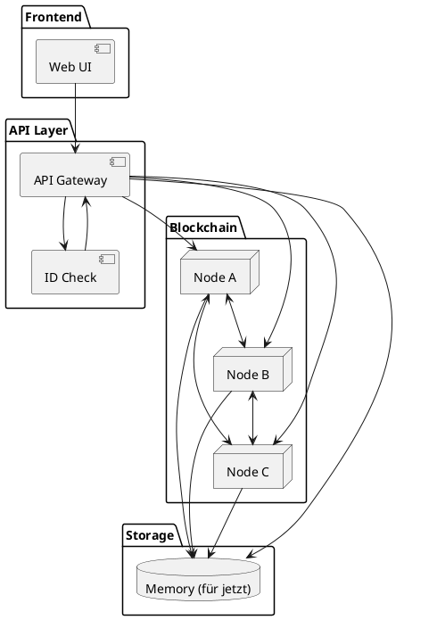
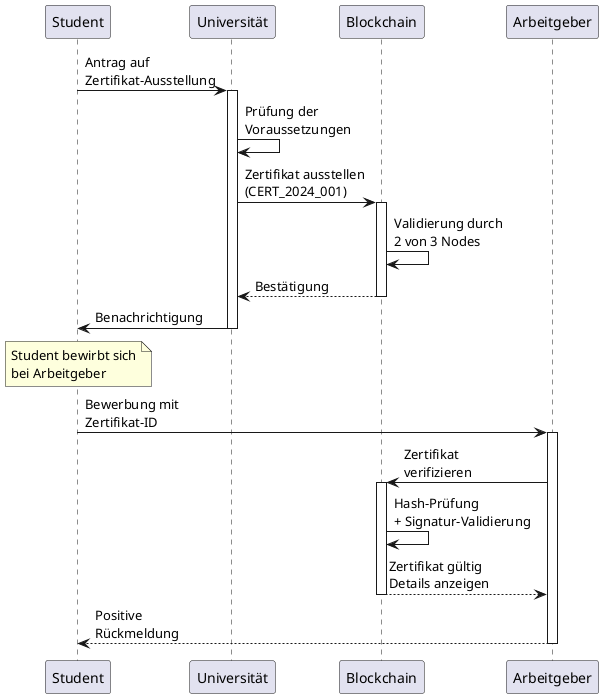

# Dezentrale Blockchain für Bildungszertifikate

## Inhalt

- [1. Problem- und Zieldefinition](#1-problem--und-zieldefinition)
   - [1.1. Identifizierung des Problems](#11-identifizierung-des-problems)
   - [1.2. Blockchain-Technologie als Lösung](#12-blockchain-technologie-als-lösung)
   - [1.3. Ziele der Applikation](#13-ziele-der-applikation)
- [2. Blockchain-Architektur](#2-blockchain-architektur)
   - [2.1. Systemarchitektur (Überblick)](#21-systemarchitektur-überblick)
   - [2.2. Netzwerk-Topologie (3 Nodes)](#22-netzwerk-topologie-3-nodes)
   - [2.3. Node-Rollen und Berechtigungen](#23-node-rollen-und-berechtigungen)
   - [2.4. Consensus](#24-consensus)
   - [2.5. Möglicher Transaktionsablauf](#25-möglicher-transaktionsablauf)
   - [2.6. Klassendiagramm](#26-klassendiagramm)
- [3. Webfrontend-Design und Funktionalität](#3-webfrontend-design-und-funktionalität)
   - [3.1. Screen 1: Dashboard (Zertifikatsverwaltung)](#31-screen-1-dashboard-zertifikatsverwaltung)
      - [3.1.1. Funktionalitäten](#311-funktionalitäten)
   - [3.2. Screen 2: Zertifikat ausstellen](#32-screen-2-zertifikat-ausstellen)
      - [3.2.1. Funktionalitäten](#321-funktionalitäten)
   - [3.3. Screen 3: Zertifikat anzeigen & verifizieren](#33-screen-3-zertifikat-anzeigen--verifizieren)
      - [3.3.1. Funktionalitäten](#331-funktionalitäten)
   - [3.4. Datenvisualisierungskonzept](#34-datenvisualisierungskonzept)
- [4. Herausforderungen und Lösungen](#4-herausforderungen-und-lösungen)
   - [4.1. Technische Herausforderungen](#41-technische-herausforderungen)
      - [4.1.1. Datenschutz und DSGVO-Compliance](#411-datenschutz-und-dsgvo-compliance)
      - [4.1.2. Real-Time Verifikation](#412-real-time-verifikation)
      - [4.1.3. Skalierbarität und Performance](#413-skalierbarkeit-und-performance)

## 1. Problem- und Zieldefinition

### 1.1. Identifizierung des Problems

In der heutigen digitalisierten Welt besteht ein kritisches Problem bei der _Authentifizierung von
Bildungsabschlüssen und beruflichen Zertifikaten_ :

Kernprobleme:

- Gefälschte Diplome: Immer mehr gefälschte Universitätsabschlüsse im Umlauf
- Zeitaufwändige Verifikation: HR-Abteilungen müssen aufwändig bei Institutionen
    nachfragen
- Dokumentenverlust: Physische Zertifikate können verloren gehen oder beschädigt
    werden
- Internationale Anerkennung: Schwierigkeiten bei der Überprüfung ausländischer
    Abschlüsse
- Veraltete Systeme: Viele Bildungseinrichtungen nutzen noch papierbasierte Systeme

Konkrete Auswirkungen:

- Personalentscheider können Qualifikationen nicht schnell überprüfen
- Bewerber haben Schwierigkeiten, ihre Leistungen glaubwürdig nachzuweisen
- Bildungseinrichtungen werden häufig mit Verifikationsanfragen belastet
- Gefälschte Abschlüsse verschlechtern das Vertrauen in das Bildungssystem

### 1.2. Blockchain-Technologie als Lösung

Die Blockchain-Technologie bietet perfekte Eigenschaften für dieses Problem:

- Unveränderlichkeit: Einmal ausgestellte Zertifikate können nicht gefälscht oder
    manipuliert werden
- Transparenz: Alle Beteiligten können die Echtheit von Zertifikaten sofort überprüfen
- Dezentralisierung: Keine zentrale Autorität erforderlich, alle Bildungseinrichtungen
    können teilnehmen
- Zeitstempel: Exakte Dokumentation wann Abschlüsse erworben wurden
- Digitale Signaturen: Kryptographische Bestätigung der ausstellenden Institution

### 1.3. Ziele der Applikation

1. Sofortige Verifikation: Zertifikate in Sekunden überprüfbar
2. Fälschungssicherheit: Kryptographisch gesicherte Echtheitsprüfung
3. Einfache Verwaltung: Digitale Sammlung aller Abschlüsse und Zertifikate
4. Internationale Kompatibilität: Grenzüberschreitende Anerkennung
5. Kostenreduktion: Weniger Aufwand für manuelle Verifikation

## 2. Blockchain-Architektur

### 2.1. Systemarchitektur (Überblick)

### 2.2. Netzwerk-Topologie (3 Nodes)

### 2.3. Node-Rollen und Berechtigungen

- Node 1 - Universität:
    o Stellt akademische Abschlüsse aus (Bachelor, Master, PhD)
    o Verwaltet Studentendaten und Noten
    o Kann Zertifikate ausstellen und widerrufen
- Node 2 - Berufsschule/Fachschule:
    o Stellt berufliche Qualifikationen aus
    o Verwaltet Ausbildungsabschlüsse
    o Dokumentiert praktische Fertigkeiten
- Node 3 - Zertifizierungsanbieter:
    o Stellt Weiterbildungszertifikate aus
    o Verwaltet Kurse und Schulungen
    o Überwacht Gültigkeitsdauer von Zertifikaten

### 2.4. Consensus

Da nur 3 vertrauensvolle Bildungseinrichtungen im Netzwerk sind, wird ein Proof of Authority
(PoA) Consensus verwendet:

- Jede Institution hat eine verifizierte Identität
- Validierung erfolgt durch Mehrheitsentscheidung (2 von 3 Nodes)
- Sehr schnelle Transaktionszeiten
- Energieeffizient und kostengünstig

### 2.5. Möglicher Transaktionsablauf

### 2.6. Klassendiagramm

## 3. Webfrontend-Design und Funktionalität

### 3.1. Screen 1: Dashboard (Zertifikatsverwaltung)

#### 3.1.1. Funktionalitäten

- Übersicht aller eigenen Zertifikate
- Schnelle Verifikation fremder Zertifikate
- Status der Bildungseinrichtungen im Netzwerk
- Einfache Navigation zwischen Funktionen

### 3.2. Screen 2: Zertifikat ausstellen

#### 3.2.1. Funktionalitäten

- Benutzerfreundlicher 3-Schritt-Wizard
- Automatische Validierung der Eingaben
- Vorschau des finalen Zertifikats
- Digitale Signatur der Institution

### 3.3. Screen 3: Zertifikat anzeigen & verifizieren

#### 3.3.1. Funktionalitäten

- Vollständige Zertifikatsinformationen

- Blockchain-Verifikation mit Hash-Anzeige

### 3.4. Datenvisualisierungskonzept

1. Zertifikats-Dashboard:
    - Übersichtliche Karten-Ansicht aller Zertifikate
    - Status-Anzeige (Gültig, Abgelaufen, Widerrufen)
    - Filtermöglichkeiten nach Institution, Datum, Typ
2. Verifikations-Timeline:
    - Chronologische Darstellung der Zertifikatserstellung
    - Wer hat wann welches Zertifikat überprüft
    - Einfache Suchfunktion
3. Institutions-Netzwerk:
    - Visualisierung der teilnehmenden Bildungseinrichtungen
    - Anzahl ausgestellter Zertifikate pro Institution
    - Vertrauensstatus und Akkreditierung

## 4. Herausforderungen und Lösungen

### 4.1. Technische Herausforderungen

#### 4.1.1. Datenschutz und DSGVO-Compliance

Problem:

- Personenbezogene Daten in unveränderlicher Blockchain
- Recht auf Vergessenwerden vs. Blockchain-Unveränderlichkeit
- Internationale Übertragung von Bildungsdaten

Lösungsansätze:

- Minimal Data Approach: Nur notwendige Daten in der Blockchain
- Hash-basierte Speicherung: Persönliche Daten extern, nur Hashes on-chain
- Consent Management: Explizite Zustimmung für jede Datenverwendung
- Regional Compliance: Separate Behandlung nach Rechtsräumen

#### 4.1.2. Real-Time Verifikation

Problem:

- Arbeitgeber erwarten sofortige Bestätigung
- Blockchain-Transaktionen benötigen Bestätigungszeit
- Netzwerk kann temporär nicht verfügbar sein

Lösungsansätze:

- Effizient es Caching
- Eve ntuell SLA-Agreements

#### 4.1.3. Skalierbarkeit und Performance

Problem:

- Wachsende Anzahl von Zertifikaten führt zu größerer Blockchain
- Längere Synchronisationszeiten bei neuen Nodes
- Potentielle Leistungseinbußen bei gleichzeitigen Verifikationsanfragen
- Speicheranforderungen steigen kontinuierlich

Lösungsansätze:

- Layer-2-Lösungen: Off-Chain-Transaktionen für häufige Operationen
- Archivierung: Ältere Zertifikate in separaten Speichersystemen
- Load Balancing: Verteilung der Verifikationslasten auf mehrere Nodes
- Optimierte Datenstrukturen: Merkle Trees für effiziente Batch-Verifikation

