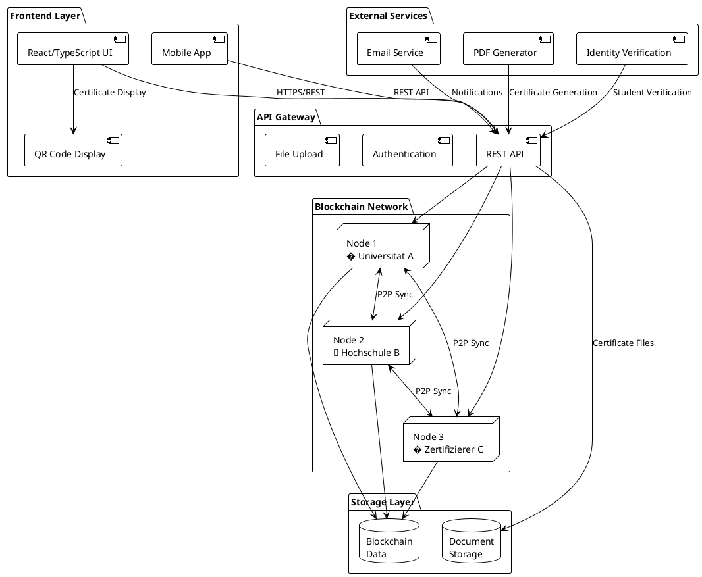
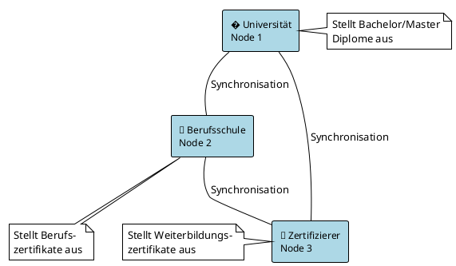
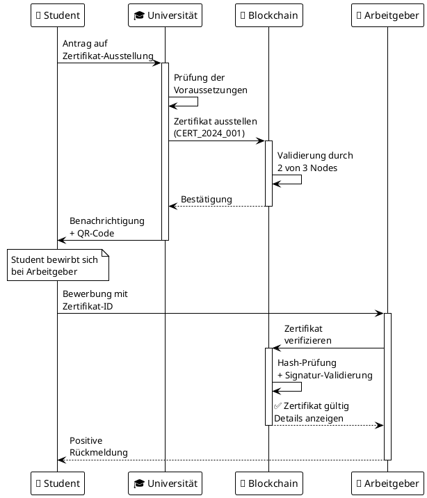
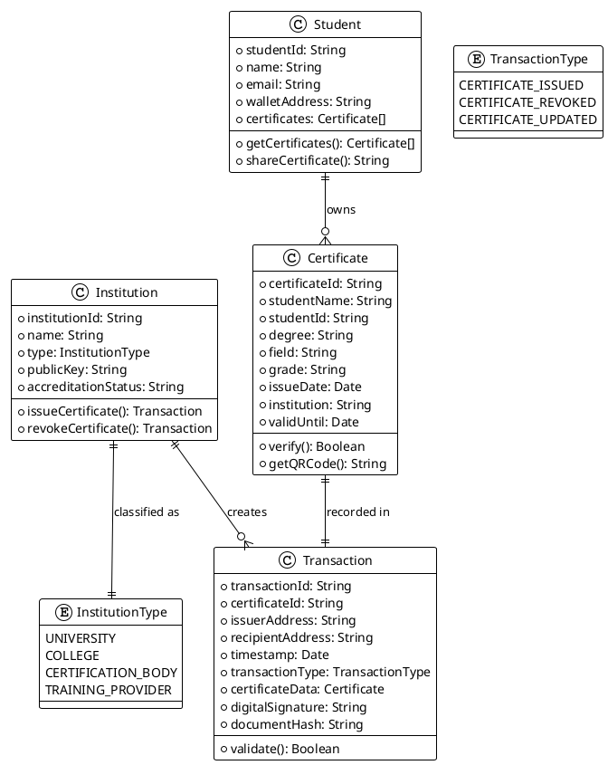
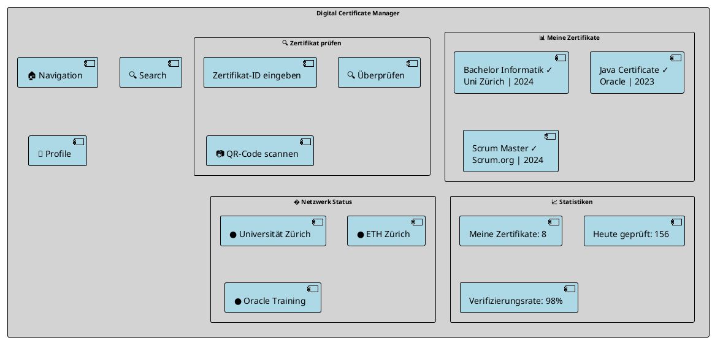
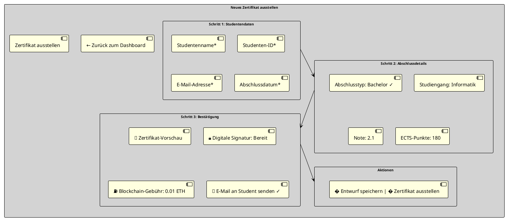
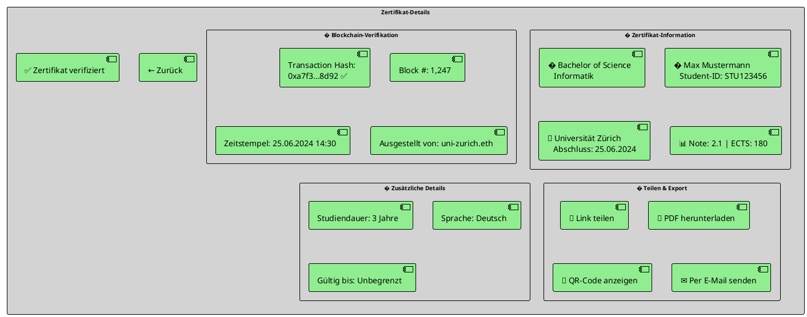

# Blockchain-Konzept: Digitales Zertifikatssystem
## Fälschungssichere Verwaltung von Bildungsabschlüssen und Zertifikaten

**Autor:** [Ihr Vorname_Nachname]  
**Datum:** 26. Juni 2025  
**Projekt:** Dezentrale Blockchain für Bildungszertifikate

---

## 1. Problem- und Zieldefinition

### Identifizierung des Problems

In der heutigen digitalisierten Welt besteht ein kritisches Problem bei der **Authentifizierung von Bildungsabschlüssen und beruflichen Zertifikaten**:

**Kernprobleme:**
- **Gefälschte Diplome**: Immer mehr gefälschte Universitätsabschlüsse im Umlauf
- **Zeitaufwändige Verifikation**: HR-Abteilungen müssen aufwändig bei Institutionen nachfragen
- **Dokumentenverlust**: Physische Zertifikate können verloren gehen oder beschädigt werden
- **Internationale Anerkennung**: Schwierigkeiten bei der Überprüfung ausländischer Abschlüsse
- **Veraltete Systeme**: Viele Bildungseinrichtungen nutzen noch papierbasierte Systeme

**Konkrete Auswirkungen:**
- Personalentscheider können Qualifikationen nicht schnell überprüfen
- Bewerber haben Schwierigkeiten, ihre Leistungen glaubwürdig nachzuweisen
- Bildungseinrichtungen werden häufig mit Verifikationsanfragen belastet
- Gefälschte Abschlüsse untergraben das Vertrauen in das Bildungssystem

### Blockchain-Technologie als Lösung

Die Blockchain-Technologie bietet perfekte Eigenschaften für dieses Problem:

**Unveränderlichkeit**: Einmal ausgestellte Zertifikate können nicht gefälscht oder manipuliert werden.

**Transparenz**: Alle Beteiligten können die Echtheit von Zertifikaten sofort überprüfen.

**Dezentralisierung**: Keine zentrale Autorität erforderlich, alle Bildungseinrichtungen können teilnehmen.

**Zeitstempel**: Exakte Dokumentation wann Abschlüsse erworben wurden.

**Digitale Signaturen**: Kryptographische Bestätigung der ausstellenden Institution.

### Ziele der Applikation

1. **Sofortige Verifikation**: Zertifikate in Sekunden überprüfbar
2. **Fälschungssicherheit**: Kryptographisch gesicherte Echtheitsprüfung
3. **Einfache Verwaltung**: Digitale Sammlung aller Abschlüsse und Zertifikate
4. **Internationale Kompatibilität**: Grenzüberschreitende Anerkennung
5. **Kostenreduktion**: Weniger Aufwand für manuelle Verifikation
6. **Lebenslanges Portfolio**: Kontinuierliche Sammlung von Weiterbildungen

---

## 2. Blockchain-Architektur

### Systemarchitektur (Überblick)



### Vereinfachte Netzwerk-Topologie (3 Nodes)



### Node-Rollen und Berechtigungen

**Node 1 - Universität:**
- Stellt akademische Abschlüsse aus (Bachelor, Master, PhD)
- Verwaltet Studentendaten und Noten
- Kann Zertifikate ausstellen und widerrufen

**Node 2 - Berufsschule/Fachschule:**
- Stellt berufliche Qualifikationen aus
- Verwaltet Ausbildungsabschlüsse
- Dokumentiert praktische Fertigkeiten

**Node 3 - Zertifizierungsanbieter:**
- Stellt Weiterbildungszertifikate aus
- Verwaltet Kurse und Schulungen
- Überwacht Gültigkeitsdauer von Zertifikaten

### Vereinfachte Transaktionsstruktur

```json
{
  "transactionType": "CERTIFICATE_ISSUED",
  "certificateId": "CERT_2024_001",
  "issuerAddress": "university_wallet_address",
  "recipientAddress": "student_wallet_address",
  "timestamp": "2024-06-25T10:30:00Z",
  "certificateData": {
    "studentName": "Max Mustermann",
    "studentId": "STU123456",
    "degree": "Bachelor of Science",
    "field": "Computer Science",
    "grade": "2.1",
    "issueDate": "2024-06-25",
    "institution": "Universität Zürich",
    "validUntil": null
  },
  "metadata": {
    "courseDuration": "3 years",
    "credits": "180 ECTS",
    "language": "German"
  },
  "digitalSignature": "university_signature",
  "documentHash": "sha256_hash_of_certificate"
}
```

### Consensus-Mechanismus

Da nur 3 vertrauensvolle Bildungseinrichtungen im Netzwerk sind, wird ein **Proof of Authority (PoA)** Consensus verwendet:
- Jede Institution hat eine verifizierte Identität
- Validierung erfolgt durch Mehrheitsentscheidung (2 von 3 Nodes)
- Sehr schnelle Transaktionszeiten
- Energieeffizient und kostengünstig

### Einfacher Transaktionsablauf (Sequenzdiagramm)



### Vereinfachtes Datenmodell (Klassendiagramm)



---

## 3. Webfrontend-Design und Funktionalität

### Screen 1: Dashboard - Zertifikatsverwaltung



**Funktionalitäten:**
- Übersicht aller eigenen Zertifikate
- Schnelle Verifikation fremder Zertifikate
- QR-Code Scanner für mobile Nutzung
- Status der Bildungseinrichtungen im Netzwerk
- Einfache Navigation zwischen Funktionen

### Screen 2: Zertifikat ausstellen (für Institutionen)



**Funktionalitäten:**
- Benutzerfreundlicher 3-Schritt-Wizard
- Automatische Validierung der Eingaben
- Vorschau des finalen Zertifikats
- E-Mail-Benachrichtigung an Studenten
- Digitale Signatur der Institution

### Screen 3: Zertifikat anzeigen & verifizieren



**Funktionalitäten:**
- Vollständige Zertifikatsinformationen
- Blockchain-Verifikation mit Hash-Anzeige
- Einfache Sharing-Optionen
- PDF-Export für offline Verwendung
- QR-Code für mobile Verifikation

### Vereinfachte Datenvisualisierung

**1. Zertifikats-Dashboard:**
- Übersichtliche Karten-Ansicht aller Zertifikate
- Status-Anzeige (Gültig, Abgelaufen, Widerrufen)
- Filtermöglichkeiten nach Institution, Datum, Typ

**2. Verifikations-Timeline:**
- Chronologische Darstellung der Zertifikatserstellung
- Wer hat wann welches Zertifikat überprüft
- Einfache Suchfunktion

**3. Institutions-Netzwerk:**
- Visualisierung der teilnehmenden Bildungseinrichtungen
- Anzahl ausgestellter Zertifikate pro Institution
- Vertrauensstatus und Akkreditierung

---

## 4. Herausforderungen und Lösungen

### Vereinfachte technische Herausforderungen

#### 4.1 Benutzerakzeptanz und Einfachheit

**Problem:**
- Bildungseinrichtungen sind oft technologisch konservativ
- Studenten und Arbeitgeber müssen das System verstehen und vertrauen
- Bestehende Papier-Zertifikate sind etabliert

**Lösungsansätze:**
- **Hybrid-Ansatz**: Parallel zu digitalen auch weiterhin Papier-Zertifikate
- **Schrittweise Einführung**: Pilotprojekt mit einzelnen Instituten
- **Einfache Benutzeroberfläche**: Keine Blockchain-Terminologie sichtbar
- **QR-Code Integration**: Physische Zertifikate mit digitalem Nachweis
- **Mobile-First Design**: Einfache Smartphone-Nutzung

#### 4.2 Datenschutz und DSGVO-Compliance

**Problem:**
- Personenbezogene Daten in unveränderlicher Blockchain
- Recht auf Vergessenwerden vs. Blockchain-Unveränderlichkeit
- Internationale Übertragung von Bildungsdaten

**Lösungsansätze:**
- **Minimal Data Approach**: Nur notwendige Daten in der Blockchain
- **Hash-basierte Speicherung**: Persönliche Daten extern, nur Hashes on-chain
- **Consent Management**: Explizite Zustimmung für jede Datenverwendung
- **Regional Compliance**: Separate Behandlung nach Rechtsräumen

#### 4.3 Skalierbarkeit für Bildungssektor

**Problem:**
- Millionen von Studenten und Absolventen weltweit
- Sehr viele kleine Transaktionen (Zertifikats-Ausstellungen)
- Wachsende Anzahl teilnehmender Institutionen

**Lösungsansätze:**
- **Batch-Processing**: Mehrere Zertifikate in einer Transaktion
- **Layer 2 Solutions**: Seitenketten für häufige Operationen  
- **Intelligentes Pruning**: Alte Daten archivieren, Hashes behalten
- **Federated Approach**: Regionale Blockchain-Netzwerke

### Frontend-spezifische Herausforderungen

#### 4.4 Einfache Wallet-Verwaltung

**Problem:**
- Bildungseinrichtungen brauchen sichere aber einfache Wallets
- Studenten verstehen Private Keys oft nicht
- Verlust von Zugangsdaten bedeutet Verlust der Zertifikate

**Lösungsansätze:**
```typescript
// Vereinfachte Wallet-Abstraktion
interface SimpleWallet {
  // Benutzer sieht nur eine PIN/Passwort
  login(email: string, password: string): Promise<boolean>;
  
  // Automatische Backup-Erstellung
  createBackup(): string; // Returns recovery phrase
  
  // Social Recovery über Institutionen
  initiateRecovery(email: string): Promise<void>;
  
  // Zertifikat anzeigen ohne technische Details
  getCertificates(): Certificate[];
  
  // Einfache Verifikation
  verifyCertificate(certificateId: string): Promise<VerificationResult>;
}

// Multi-Sig für Institutionen
class InstitutionWallet {
  private requiredSignatures = 2; // 2 von 3 Administratoren
  private administrators: string[];
  
  async issueCertificate(certificate: Certificate): Promise<string> {
    // Sammelt Signaturen von mehreren Administratoren
    const signatures = await this.collectSignatures(certificate);
    if (signatures.length >= this.requiredSignatures) {
      return this.submitToBlockchain(certificate, signatures);
    }
    throw new Error('Insufficient signatures');
  }
}
```

#### 4.5 Real-time Verifikation

**Problem:**
- Arbeitgeber erwarten sofortige Bestätigung
- Blockchain-Transaktionen benötigen Bestätigungszeit
- Netzwerk kann temporär nicht verfügbar sein

**Lösungsansätze:**
```typescript
// Intelligent Caching für schnelle Verifikation
class CertificateVerifier {
  private cache = new Map<string, CachedVerification>();
  
  async verifyCertificate(certificateId: string): Promise<VerificationResult> {
    // 1. Prüfe lokalen Cache
    const cached = this.cache.get(certificateId);
    if (cached && this.isCacheValid(cached)) {
      return cached.result;
    }
    
    // 2. Prüfe mehrere Blockchain-Nodes parallel
    const promises = this.blockchainNodes.map(node => 
      node.getCertificate(certificateId)
    );
    
    try {
      // Verwende das erste verfügbare Ergebnis
      const result = await Promise.race(promises);
      this.updateCache(certificateId, result);
      return result;
    } catch (error) {
      // Fallback: Zeige letztes bekanntes Ergebnis
      return cached?.result || { status: 'unknown' };
    }
  }
  
  private isCacheValid(cached: CachedVerification): boolean {
    const fiveMinutes = 5 * 60 * 1000;
    return Date.now() - cached.timestamp < fiveMinutes;
  }
}
```

### Vereinfachtes Deployment

#### 4.6 Container-basierte Lösung

```yaml
# docker-compose.yml für einfaches Deployment
version: '3.8'
services:
  frontend:
    build: ./frontend
    ports:
      - "3000:3000"
    environment:
      - REACT_APP_API_URL=http://localhost:3001
      - REACT_APP_BLOCKCHAIN_NETWORK=local
  
  api:
    build: ./backend
    ports:
      - "3001:3001"
    environment:
      - NODE_ENV=production
      - BLOCKCHAIN_NODES=node1:8545,node2:8545,node3:8545
    depends_on:
      - mongodb
      - node1
  
  node1:  # Universität
    image: ethereum/client-go
    command: --dev --rpc --rpcaddr 0.0.0.0
    ports:
      - "8545:8545"
  
  node2:  # Berufsschule
    image: ethereum/client-go
    command: --dev --rpc --rpcaddr 0.0.0.0
    ports:
      - "8546:8545"
  
  node3:  # Zertifizierer
    image: ethereum/client-go
    command: --dev --rpc --rpcaddr 0.0.0.0
    ports:
      - "8547:8545"
  
  mongodb:
    image: mongo:5
    environment:
      - MONGO_INITDB_ROOT_USERNAME=admin
      - MONGO_INITDB_ROOT_PASSWORD=password
    volumes:
      - mongo_data:/data/db

volumes:
  mongo_data:
```

---

## Fazit

Dieses vereinfachte Konzept zeigt, wie eine Blockchain-basierte Zertifikatsverwaltung ein konkretes Problem im Bildungsbereich lösen kann. Die Kombination aus nur 3 Nodes, einfacher Benutzeroberfläche und klarem Anwendungsfall macht das System:

**Vorteile der vereinfachten Lösung:**
- **Einfach zu verstehen**: Klarer Anwendungsfall ohne komplexe Lieferketten
- **Schnell umsetzbar**: Weniger Nodes und Akteure bedeuten weniger Komplexität
- **Sofortiger Nutzen**: Direkte Zeitersparnis bei Zertifikatsverifikation
- **Skalierbar**: Einfache Erweiterung um weitere Bildungseinrichtungen
- **Geringere Kosten**: Weniger Infrastructure und Wartungsaufwand

**Technische Einfachheit:**
- 3 Nodes statt 5 (weniger Netzwerk-Komplexität)
- Einfache Transaktionstypen (nur Ausstellen, Verifizieren, Widerrufen)
- Keine IoT-Integration oder GPS-Tracking erforderlich
- Standardisierte Zertifikatsdaten ohne komplexe Metadaten
- Mobile-First Ansatz mit QR-Codes

**Praktische Umsetzbarkeit:**
- Bestehende Bildungseinrichtungen können schrittweise teilnehmen
- Kompatibilität mit bestehenden Systemen durch APIs
- Niedrige Einstiegsbarriere für Institutionen
- Klarer ROI durch Kostenersparnis bei Verifikationen

**Nächste Schritte für die vereinfachte Implementierung:**
1. **Proof of Concept** mit einer Universität und einem Zertifizierer
2. **MVP-Entwicklung** mit den 3 Kern-Features (Ausstellen, Anzeigen, Verifizieren)
3. **Pilottest** mit ausgewählten Studenten und Arbeitgebern
4. **Iterative Erweiterung** um weitere Institutionen und Features
5. **Standardisierung** der Datenmodelle für breiteren Einsatz

Dieses System ist deutlich einfacher zu entwickeln und zu betreiben als das ursprüngliche Supply Chain System, bietet aber dennoch alle Vorteile der Blockchain-Technologie für Vertrauen, Transparenz und Unveränderlichkeit.

---

*Konzept erstellt für: Blockchain-Applikation Einzelarbeit*  
*Datum: 26. Juni 2025*  
*Umfang: Vereinfachte Lösung für Bildungszertifikate*
